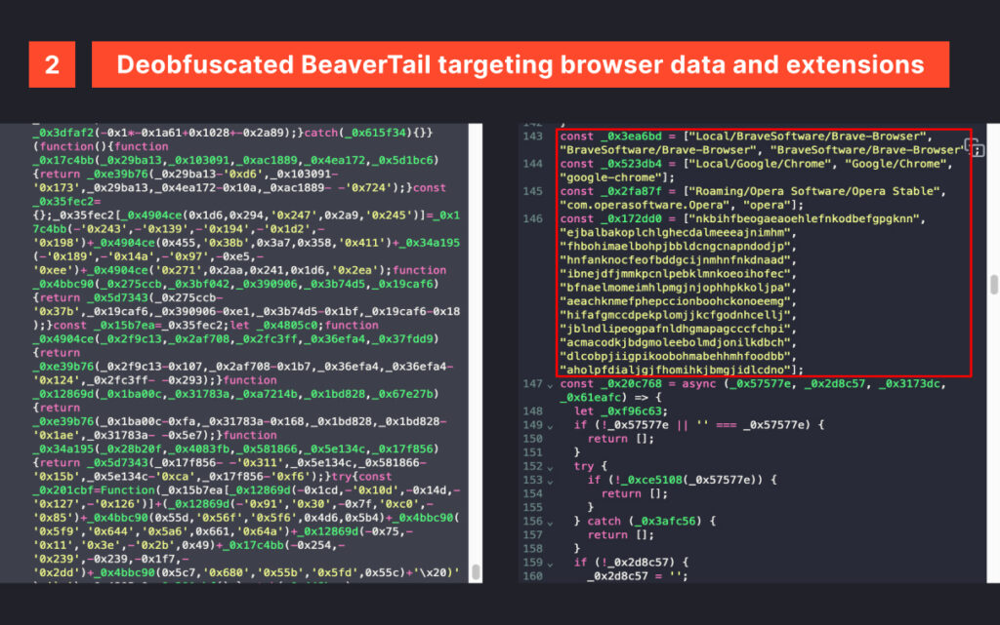
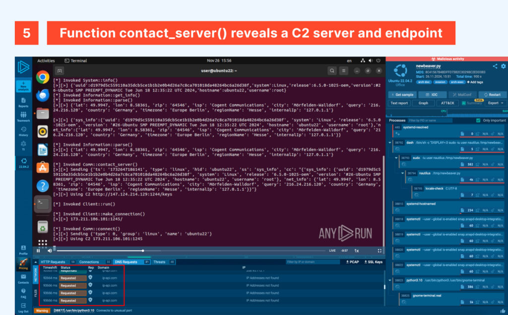
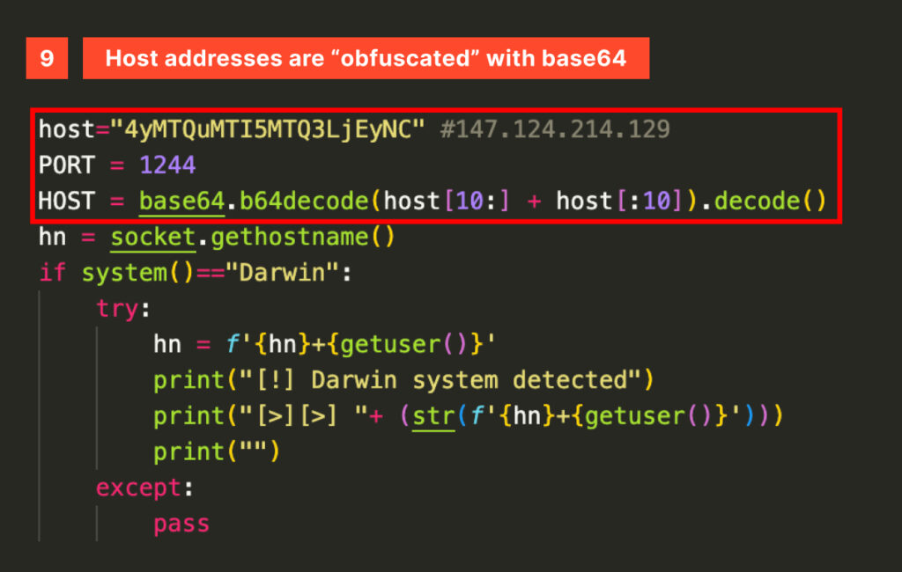
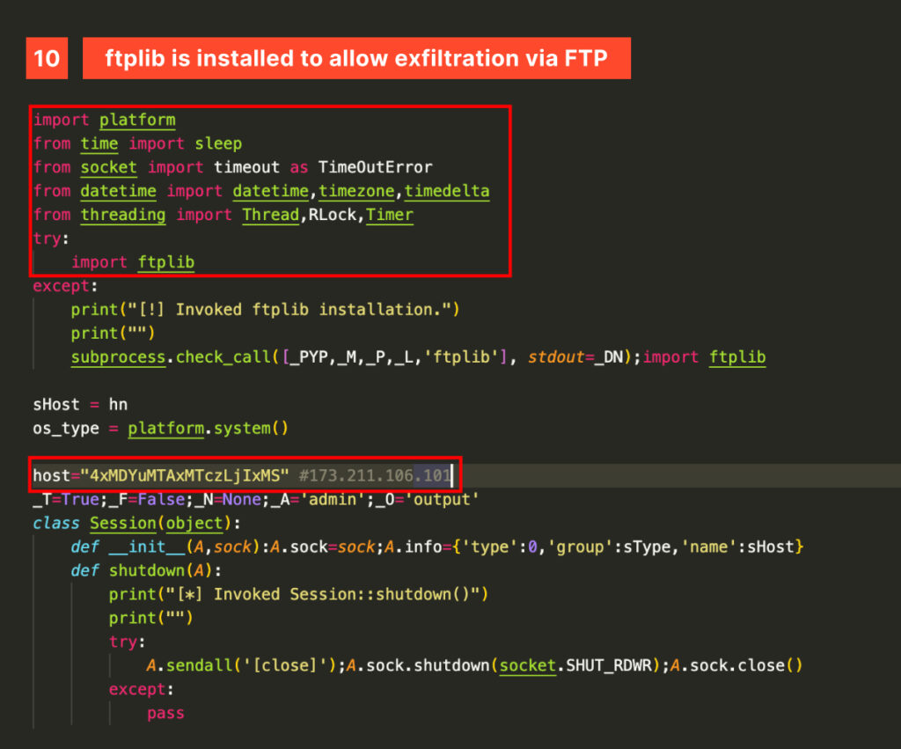

# InvisibleFerret Malware: Technical Analysis
## Jan 21, 2025
### [Any Run Blog](https://any.run/cybersecurity-blog/invisibleferret-malware-analysis/?utm_source=thehackernews_x&utm_medium=post&utm_campaign=invisibleferret_analysis&utm_content=blog&utm_term=220125)
---
 

최근 10, 11월동안 북한이 채용 면접 가장하여 종류의 악성코드를 유포하는 방식이 관찰됐다. 이러한 기법은 이전에도 **QRLog와 Docks/RustDoor** 배포에 사용된 적 있으며, 현재는 **BeaverTail과 InvisibleFerret** 배포하는 데 사용되고 있다.

### The Beaver

가짜 면접을 통해 멀웨어를 목표로 하여 **Contagious Interview(전염성 인터뷰), DevPopper**라고도 알려졌다. 
배포된 악성코드 중 하나가 BeaverTail이며, 난독화된 JavaScript로 작성된 **Stealer & Loader(정보 탈취 및 로더)**이며, NPM 모듈로 전달된다 
해당 악성코드는 커스텀 포터블 Python 환경(p.zip)을 다운로드한 후, InvisibleFerret을 배포한다

### InvisibleFerret
Python 기반 악성코드로, 구조가 어수선하고 불필요한 이스케이프 시퀀스가 포함되어 있다.
- 수집 대상 정보
  - Geo-location(지리적 위치)
    - 합법적 서비스인 ip-api.com을 쿼리하여 IP 주소 기반 위치 정보 획득
    - "ETH Polygon BNB"같은 드레이너나 악성코드에서 자주 사용
  - 시스템 세부 정보 
    - OS 버전, 호스트 이름, 사용자 이름 수집 후 고유 식별자(ID) 생성기
- 샌드박스 분석 결과 요약
  1. C2 서버 통신
  
    - 비정상적 포트(1244, 1245) 사용해 C2 서버아 통신
    - `/keys` 엔드포인트 접근 후 감염된 호스트 이름을 C2 서버에 등록 후 운영체제에 따라 태깅
  2. 트래픽 분석
    - `pip` 패키지 매니저를 통한 합법적 요청이 대부분의 트래픽
    - 동일한 Python 스크립트에서 **합법적인 요청과 악성 요청이 섞여 있음**
  3. 악성코드 구조 및 특징
    
    - 난독화 및 Base64 인코등 통해 C2 주소 숨김
    
    - FTP 통해 데이터 유출 수행 시 `ftplib` 패키지 자동 설치

### 악성코드 주요 기능
1. 데이터 유출 
  - FTP를 통해 서버로 전송
  - XOR 암호화 사용해 전송 전 간단한 보호 계층 추가
2. 파일 압축 : 데이터 유출을 위한 압축 과정 진행
3. 지속성 유지 
  - AnyDesk 원격 데스크톱 소프트웨어 다운로드 및 수행 
  - -> 공격자의 지속적 접근 확보
4. 브라우저 데이터 탈취
  - 대상 브라우저 : Chrome, Chromium, Opera, Brave, Edge, Vivaldi
  - 프로필, 쿠키, 자격 증명, 브라우징 기록 추출
  - 주요 목표 : 암호화폐 지갑, MFA 앱, 패스워드 매니저 같은 브라우저 확장 프로그램
5. 텔레그램 API 통한 데이터 유출
  - `Bots API sendDocument` 엔드포인트 활용
  - 로컬에 저장된 Telegram Bot Token 및 Chat ID 통해 공격자가 봇 제어 및 수정 가능
6. 키로깅 및 클립보드 탈취
  - Windosws 시스템에서 `pyWinhook`, `pyperclip` 모듈 사용
  - 50ms마다 클립보드 변경 내용 캡초 및 유출
  - Chrome, Brave 브라우저 프로세스 종료하고 데이터 유출

 

### What's new for me
- Dev#Popper : 소프트웨어 개발자를 대상으로 가짜 면접을 통해 Python 원격 접근 트로이 목마(RAT)을 설치하도록 하는 소셜 엔지니어링 캠페인
  - 가짜 채용 인터뷰를 통해 BeaverTail, InvisibleFerret, CivetQ와 같은 악성코드 배포
  - 라자루스 그룹이 배후며, Datalog에 의해 새로운 그룹인 Tenacious Pungsan으로 분류됨
  - 주 목적 : 정보 수집 및 금융 찰취
  - TTP 개요
    1. 북한 위협 담당자는 기술 구직자 대상으로 가짜 채용 담당자로 사칭, 면접 과정에서 악성코드 전달
    2. 공격자는 소셜 엔지니어링을 통해 면접 준비 과정에서 소프트웨어 개발자들에게 악성 ZIP 파일이나 NPM 패키지 다운 유도함
    3. 공격자는 Linkdin, Upwork 및 기타 개발자 포럼을 이용해 피해자를 대상으로 사칭 공격 수행
    4. Windows, Linux, macOS 등 여러 운영체제 대상으로 확대
    5. 악성 스크립트는 Base64로 인코딩 되고 XOR 암호화를 사용해 탐지 회피함
- [QRLog](https://github.com/birminghamcyberarms/QRLog) : RAT 악성코드. 감염된 컴퓨어에 대한 권한 접근을 허용하는 리버스 쉘 시도하는 기능 포함됨
  - 악성코드가 Java로 작성된 QR 코드 생성기 파일 사이에 숨겨지고, 동일한 이름의 파일을 생성해 지속적으로 유지함
- [Docks/RustDoor](https://otx.alienvault.com/pulse/65c0ef492547f1c6b60729e6/) 
  - 피해자의 홈 폴더가 포함된 압축 파일과 다른 파일들이 포함된 '.docks'라는 이름의 숨겨진 폴더를 생성해 유출 준비를 함(Docks라는 이름을 갖게 된 이유)
  - 감염되면 2단계 멀웨어인 Docks가 다운로드됨
- Drainer(드레이너) : 피싱 및 악성코드 이요애 암호화폐 지갑에서 자금 탈취하는 악성 소프트웨어 또는 공격자 행위

#APT #NorthKorea #malware #RAT #social_engineering