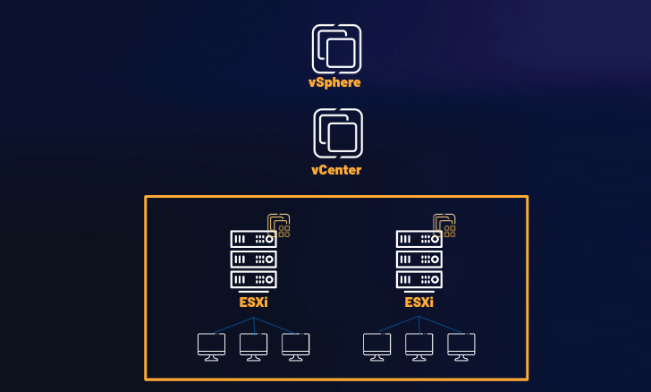

# NonEuclid, a newly discovered RAT
## Jan 08, 2025
### [The Hacker News](https://thehackernews.com/2025/01/researchers-expose-noneuclid-rat-using.html)
---
 

> 개론 
Cyfirma는 몇 주 전 새로운 원격 엑세스 트로이 목마인 NonEuclid에 대해 발표했다.

> 기능 

NonEuclid는 C#으로 개발됐으며, 안티바이러스 우회, 권한 상승, 탐지 우회, 랜섬웨어 등의 기능이 포함되어 있다. 또한 해당 RAT은 최소 24년 11월부터 디스코드와 유튜브와 같은 플랫폼을 통해 튜토리얼 등이 선전되어 왔고, 이는 crimeware로 작용하기 위함이다.  
>> **탐지 우회** 
NonEuclid는 클라이언트 애플리케이션 초기화 단계를 시작으로, 탐지 회피를 위해 확인 작업을 수행한 후에 특정 IP와 포트와 통신하기 위해 TCP 소켓을 설정한다. 또한 Microsoft Defender Antivirus의 예외 항목을 설정하여 탐지를 우회하고, `taskmgr.exe`(Windows Task Manager. 실행 중인 프로세스 목록, CPU/메모리 사용량 등 보여줌 -> 사용자가 비정상적인 프로세스(여기선 NonEuclid)가 실행 중임을 알 수 있게 됨), `procexp.exe`(Windows Task Manager보다 상세 정보 제공 -> 숨겨진 프로세스, 루트킷, 악성 DLL 주입 여부 파악 가능, 악성코드가 시스템 자원과 어떤 방식으로 상호작용하는 지 노출됨), `processhacker.exe`와 같은 프로세스를 모니터링하요 추가 탐지를 방해한다. 
`CreateToolhelp32Snapshot`(시스템의 현재 프로세스 상태 캡쳐), `Process32First`(프로세스 목록에서 첫 번째 프로세스 가져옴), `Process32Next`(프로세스 목록의 다음 항목으로 이동)와 같은 Windows API(실행 중인 시스템 프로세스 탐색/열거 시 사용) 함수를 사용하여 현재 실행 중인 프로세스 목록을 나열하여 앞서 말한 `taskmgr.exe`, `procexp.exe`, `processhacker.exe` 등의 프로세스의 실행 여부를 파악하여 AntiProcessMode 설정에 따라 강제 종료하거나 RAT 자체가 종료되도록 한다. 

 

### What's new for me
- RAT : Remote Access Trojan
- Crimeware Solution : class of malware designed specifically to automate cybercrime

#RAT #anti-detection