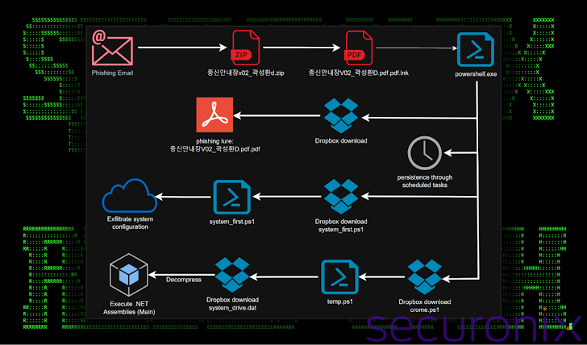

# North Korean APT43 Uses PowerShell and Dropbox in Targeted South Korea Cyberattacks
## Feb 13, 2025
### [The Hacker News](https://thehackernews.com/2025/02/north-korean-apt43-uses-powershell-and.html)
---
 

북한의 국가적 위협 행위자가 한국의 기업, 정부, 암호화폐 분야를 대상으로 캠페인을 진행하고 있다.

"DEEP#DRIVE"라고 불리는 공격 캠페인의 배후는 김수키 그룹으로, APT43, Black Banshee, Emerald Sleet, Sparkling Pisces, Springtail, TA427, Velvet Chollima라는 이름으로도 불리고 있다. 

### Attack Method
공격자들은 한국어로 작성된 위장된 문서를 맞춤형 피싱 미끼로 활용하고 있다고 연구자들은 말했다. 
피싱메일을 통해 **위장문서**(.HWP, .XLSX, .PPTX)는 업무 기록, 보험 문서, 암호화폐 관련 파일로 가장하여, 해당 파일 열람 시 **감염 프로세스**를 실행하게 만든다. 
해당 공격 체인은 여러 단계에서 **PowerShell 스크립트**에 강하게 의존하는 게 특징이며, 이를 **페이로드 전달, 정찰, 실행 등**에 활용한다. 또한 **DropBox**를 사용해 **악성 페이로드 배포 및 탈취한 데이터 유출**하는 게 특징이다. 

공격은 Windosw 바로가기(.LNK)파일이 포함된 ZIP 압축 파일에서 시작한다. 정상 파일처럼 위장 후 압축 해제 후 실행되면 PowerShell 코드가 실행되어 DropBox에 호스팅된 **유인 문서(lure document)**를 가져와 표시한다. 동시에 Windows 호스트에 영구적 접근을 확보하기 위해 "ChromeUpdateTaskMachine"이라는 예약 작업을 생성한다. 
유인 문서 중 하나는 한국어로 작성되어있으며, 물류 시설에서 지게차 운행 시 안전 작업 계획과 관련된 내용이다. 문서에는 중량화물 취급 시 안전수칙과 직장 내 안전기준 준수하는 방법 등이 포함되어있다. 
해당 공격에는 총 3개의 PowerShell이 사용된다. 
1. ZIP 파일을 통해 실행된 PowerShell
- DropBox에 호스팅된 유인 문서 가져옴
- Windows 호스트의 영구적 접근 확보를 위한 "ChromeUpdateTaskMachine"이라는 예약 작업 생성
- DropBox Location과 통신해 또 다른 PowerShell 스크립트 가져옴
2. 첫 번째 PowerShell로부터 불러온 또 다른 PowerShell
- 시스템 정보 수집 및 외부로 유출
3. 추가
- 알려지지 않은 .NET 어셈블리 실행

연구원들은 OAuth 토큰 기반 DropBox API 인증 방식 사용해 시스템 정보 및 활성 프로세스 같은 정찰 데이터를 사전에 지정된 폴더로 유출할 수 있다고 한다.
 

Dropbox라는 클라우드 기반 인프라를 통해 **기존의 IP, 도메인 차단 목록 우회**하는 특징을 갖고 있다. 또한 공격자가 사용하는 드롭박스 기반 인프라(페이로드 저장소 및 데이터 유출 경로)가 지속적으로 변경되며, 공격 실행 후 드롭박스에 올려둔 파일이나 링크를 빠르게 삭제한다. 
이는 분석을 어렵게 만들면서 공격자가 자신들의 작전을 지속적으로 모니터링하고 운영 보안을 유지한다는 점을 보여둔다.

### What's new for me
- Dropbox Location : 공격자가 악성 파일을 저장하고, 피해자 정보 수집하여 업로드하는 DropBox의 특정 폴더 또는 URL 경로
  - C2 서버처럼 활용
- *ChromeUpdateTaskMachine이라는 예약 작업을 생성하는거랑 Windows 호스트에 영구적 접근 확보하는 게 무슨 연관일까?*
  - 예약 작업(Scheduled Task) 사용하여 특정 시간 또는 이벤트(예. 부팅 시, 로그인 시)마다 특정 명령 자동 실행 사능
- *OAuth 토큰 기반 DropBox API 인증 방식 사용해 시스템 정보 및 활성 프로세스 같은 정찰 데이터를 사전에 지정된 폴더로 유출할 수 있다*가 무슨 의민가
  - OAuth 토큰 이용해 DropBox API 악용해 정찰 데이터를 특정 폴더로 유출했다는 의미
  - Dropbox는 OAuth 토큰 통해 사용자 인증 수행하며 이때 사용자 계정 정보를 직접 입력하지 않아도 API 통해 데이터 업로드 및 다운로드 가능하게 함
  - 공격자는 이 점을 활용하기 위해 OAuth 토큰 확보하여 피해자 데이터를 직접 공격자의 Dropbox 계정에 전송할 수 있도록 함

#NorthKorea #north-state_threat_actor #Kimsuky #phishing #powershell_script #Dropbox_abuse #data_breach #cloud_based_infrastructure