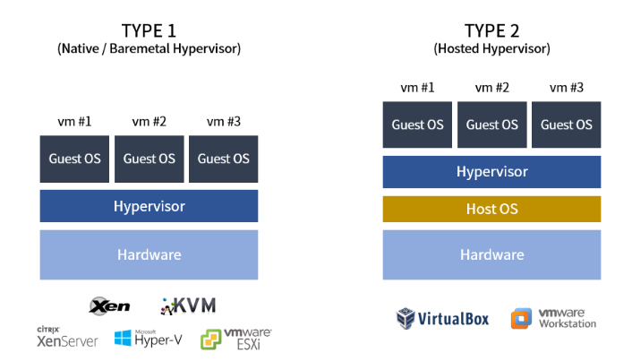

# Ransomware on ESXi: The Mechanization of Virtualized Attacks
## Jan 13, 2025
### [The Hacker News](https://thehackernews.com/2025/01/ransomware-on-esxi-mechanization-of.html)
---
 

2024년 ESXi 랜섬웨어를 타겟으로 한 랜섬웨어 문제 되고 있다. 대부분의 ESXI를 타겟으로 하는 랜섬웨어는 Babuk 랜섬웨어의 변종으로, 보안 툴들의 탐지를 회피하도록 설정되어 있다. 또한 공격자들은 초기 엑세즈 권한을 판매하여 진입 지접을 수익화하고 있다. 

> ESXi 아키텍처 

vCenter라는 중앙 관리 노드가 존재하며, 해당 서버는 기본 계정 'vpxuser'를 사용해 다른 ESXi 호스트 관리를 진행한다. 이때 "vpxuser"는 루트 권한을 보유하고 있기 때문에 ESXi 호스트에 상주하는 가상 머신 관리 작업을 담당한다.  
vCenter 서버에는 해당 서버와 연결된 ESXi 호스트의 비밀번호가 암호화된 상태로 테이블에 저장되어 있고, 해당 암호화를 복호화할 때 사용하는 비밀 키 또한 저장되어 있다. 이를 통해 vCenter 서버는 모든 ESXi 호스트를 완벽하게 제어할 수 있게 된다. 
>> 한 번 복호화되면 "vpxuser"로 설정 변경, 다른 계정의 비밀번호 바꾸기, SSH 로그인 등이 가능해진다.

### 공격 운영에 필수적인 4가지 파일 유형
  1. VMDK 파일 : 가상 머신의 하드 드라이브 내용 저장 -> 암호화되면 가상 머신 작동 불가능
  2. VMEM 파일 : 가상 머신의 페이징 파일 -> 암호화/삭제되면 데이터 손실 및 가상 머신 재게 문제 발생
  3. VSWP 파일 : 가상 머신 메모리 저장하는 스왑 파일 -> 암호화 시 가상 머신 충돌
  4. VMSN 파일 : 가상 머신 백업을 위한 스냅샷 파일 -> 공격 시 재해 복구 복잡해짐

  파일 양이 많기 때문에 공격자는 하이브리드 암호화 방식 사용한다.
  - 대칭 암호화 : AES, Chacha20 -> 대량의 데이터를 빠르고 효율적으로 암호화. 빠르게 암호화하면 보안 시스템 탐지 등 할 수 있는 기회 줄어듬
  - 비대칭 암호화 : RSA -> 대칭 암호화에 사용한 키 보호 용도로 사용

  ### 공격 위험 낮추는 4가지 방법
  1. VCSA 업데이트 : 항상 최신 버전의 VCSA(VMware vCenter Server Appliance)로 유지 
  2. MFA 도입 
  3. 탐지 도구 배포 : vCenter에 직접 탐지 및 예방 도구를 사용. EDR/XDR 및 서드파티 도구를 사용해 vCenter 모니터링하고 공격 시도 차단
  4. 네트워크 분할 : 네트워크를 분할하여 트래픽 흐름 제어하고 공격자의 lateral movement(횡적 이동) 위험 줄이기. vCenter 관리 네트워크를 다른 네트워크 세그먼트와 분리하여 잠재적 침해 가능성 줄이기

 

### What's new for me
- [가상화 개념 정리](https://worlf.tistory.com/141)
  - 하이퍼바이저 : 각 OS의 커널(하드웨어 제어하기 위한 명령어)를 해석해 하드웨어가 이해할 수 있는 명령어로 전달하는 역할
  
  - Type1 하이퍼바이저 : Native/Baremetal 하이퍼바이저. 빈 깡통 하드웨어 위에 직접 설치됨
  - Type2 하이퍼바이저 : 하드웨어 위에 기존 Host OS가 있고, Host OS 위에 하이퍼바이저 설치
- ESXi : VMware에서 출시한 Type1 하이퍼바이저이자 유닉스 계열 운영체제
- XDR(Extended Detection and Response) : 확장 탐지 및 대응 -> EDR의 진화형
  - EDR은 엔드포인트에서 활동 정보 수집 및 대응 활동 실행하는 반면 XDR은 엔트포인트, 네트워크, 서버, 클라우드 워크로드, SIEM 등과 관련된 탐지, 분석 및 대응 제공
- Single Point of Failure(SPOF) : 시스템 구성 요소 중 한 부분이 고장나면 전체 시스템이 중단되는 요소

#ransomware #ESXi #virtualization #centralized_management #centralized_administration #SPOF #virtual_machine