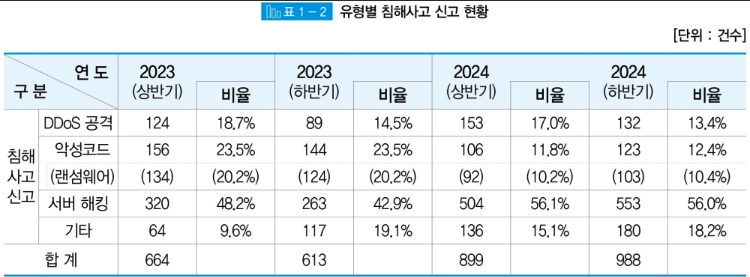
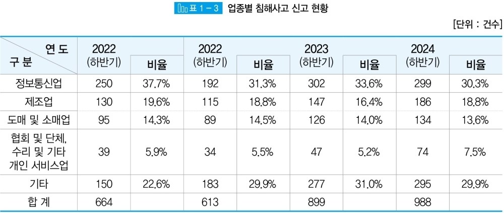

# 작년 하반기, 서버해킹 약 2배 증가...랜섬웨어 감염이 85%
## Jan 25, 2025
### [보안뉴스](https://www.boannews.com/media/view.asp?idx=135769&page=1&kind=1)
---
 

지난해 하반기 서버해킹과 랜섬웨어가 문제였다.

KISA에서 발표한 '하반기 2024 사이버 위협 동향 보고서'에 따르면, 전체 침해 사고 신고 건수는 전년 하반기 대비 61% 증가한 988건이다. 증가 요인으로는 서버해킹(553건)으로 꼽혔다.

서버해킹이 전년대비 약 2배 증가했고, 이는 공격자 해킹경유지 악용과 중소기업 홈페이지 웹 취약점을 악용한 웹쉘 공격 증가와 관련있다고 본다.

침해사고 신고 유형 중 악성코드 감염율의 85% 이상이 랜섬웨어가 차지했는데 이는 지난 4년간 8.3배 증가했다. 특히 중소/중견기업 침해사고 비중이 전체 94%를 차지했다.

협회 및 단체, 수리 및 기타 개인 서비스업이 전년 대비 66% 가장 많이 증가했다. 

랜섬웨어는 줄은 것 같지만 중소기업 비중이 늘었고, 이들 기업들은 랜섬웨어 신고보다는 해커와 협상하려는 경향이 있다고 KISA 위협분석단장은 말했다.
 

#cyber_threat_trend_report #incident_sstatistics