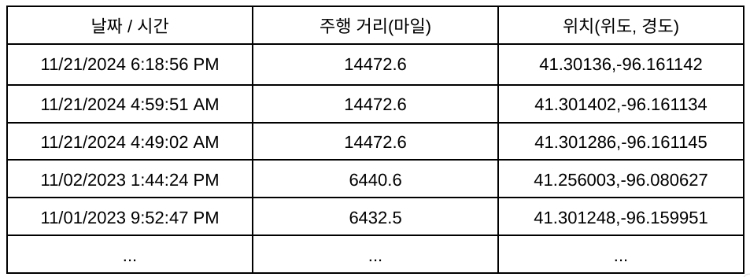

# 스바루 자동차 해킹 실험, "관리자 패널 하나 뚫었을 뿐인데"
## Feb 3, 2025
### [보안뉴스](https://m.boannews.com/html/detail.html?tab_type=1&idx=135796)
---
 

최근 보안 전문가 2명이 스타링크(Starlink)를 탑재한 스바루 사 차량에서 심각한 보안 취약점을 발견했다. 해당 취약점을 통해 미국, 캐나다, 일본에 있는 스바루 차량과 고객 계정에 무제한으로 접근할 수 있다고 했으며, 현재는 패치가 이뤄진 상태이다.

이메일 주소, 전화번호, 차량번호판 중 하나만 알아도 최소 4가지 공격이 가능하다고 밝혀냈다. 
1. 원격으로 시동 걸기
2. 문 열거다 잠그기
3. 현재 차량 위치 조회
4. 시동 걸 때마다 업데이트 되는 정보를 통해 지난 1년 간 차량 위치 기록 조회 (위치 정보 오차 범위 : 5m)
5. 차량 주인의 개인정보 일부 열람
6. 지원 요쳥 이력
7. 이전 소유자 정보 
8. 주행거리
9. 판매 이력 etc

### 사용자 앱은 문제 없으나 관리자 페이지가 노출됨
인증 과정을 통과할 수 없었다. -> 앱 보안 상태 양호, 인증 시스템도 양호 
고객용 보다 광범위한 권한을 가진 내부 직원용 앱이 있는지 확인해본 결과, *subarucs.com*이 존재하며 관리자 포탈인 스타링크 관리자 포털(STARLINK Admin Protal) *https:/ /portal.prod.subarucs.com/login.html*이 존재하는 것을 확인했다. 

이메일 주소만 있으면 관리자 포털에 로그인할 수 있었다. 링크드인과 구글 검색을 통해 스마루 직원 이메일 주소를 찾아 해당 포털 로그인에 성공했다. MFA가 걸려있었지만 간단한 조작으로 뚫렸다. 
포털에 진입하니 'Last Known Location(마지막 알려진 위치)' 메뉴가 존재했으며, 해당 메뉴에 차주의 성과 이름, 우편번호를 입력하면 지난 1년 동안 해당 차주가 다녔던 위치와 시간, 주행 거리가 표로 정리되어 있었다.
또한 해당 포털을 통해 차량 번호판 정보만 있으면 차량에 접근할 수 있었다. 
 
#connected_car #vehicle_hacking #automotive_cybersecurity #security_vulnerability #privilege_escalation #authentication_bypass #exploitation_admin_paage #Subaru #privacy_breach #data_breach #security_patch